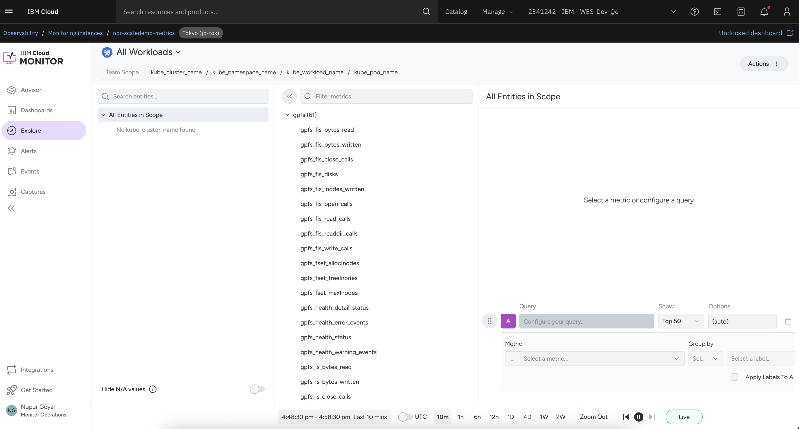
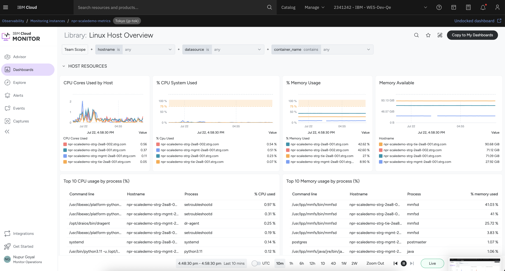

# Exposing IBM Storage Scale (GPFS) Metrics to IBM Cloud Monitoring Using Sysdig Agent

---


IBM Storage Scale exposes cluster performance data through the internal **ZiMon performance monitoring subsystem**.

The **IBM Storage Scale Bridge for Grafana** bridges this gap. It reads raw ZiMon metric data and re-exposes it in **Prometheus exposition format** on port `9250`. The **Sysdig dragent** - already deployed - scrapes that endpoint and forwards every GPFS metric to your IBM Cloud Monitoring instance.

This gives you a single-pane-of-glass view for GPFS disk I/O, CPU, NSD, filesystem throughput and cluster health - with alerting and capacity planning - without needing a standalone Grafana or Prometheus server.

---

## Architecture & Data Flow

```
 ┌─────────────────────────────────────────────────────────────────┐
 │                  IBM Storage Scale Cluster                      │
 │                                                                 │
 │  ┌─────────────────────────────────────┐                        │
 │  │         Management Node             │                        │
 │  │                                     │                        │
 │  │  ┌──────────────────────────────┐   │                        │
 │  │  │  ZiMon / pmcollector         │   │                        │
 │  │  │  REST API  :9980 (HTTPS)     │   │                        │
 │  │  └──────────┬───────────────────┘   │                        │
 │  │             │  queries / JSON        │                        │
 │  │             ▼                        │                        │
 │  │  ┌──────────────────────────────┐   │                        │
 │  │  │  Grafana Bridge              │   │                        │
 │  │  │  Prometheus exporter :9250   │   │                        │
 │  │  │  (HTTPS + Basic Auth + TLS)  │   │                        │
 │  │  └──────────┬───────────────────┘   │                        │
 │  │             │  scrape /metrics       │                        │
 │  │             ▼                        │                        │
 │  │  ┌──────────────────────────────┐   │                        │
 │  │  │  Sysdig dragent              │   │                        │
 │  │  │  (promscrape.yaml.d/)        │   │                        │
 │  │  └──────────────────────────────┘   │                        │
 │  └─────────────────────────────────────┘                        │
 │                                                                 │
 │  ┌──────────────────────┐                                       │
 │  │  Worker Nodes (N)    │                                       │
 │  │  Sysdig dragent      │  ← host metrics only (CPU, mem, net) │
 │  └──────────────────────┘                                       │
 └─────────────────────────────────────────────────────────────────┘
          │  GPFS + host metrics (HTTPS :6443)
          ▼
 ┌─────────────────────────────────┐
 │       IBM Cloud Monitoring      │
 │  Ingestion endpoint  :6443      │
 │  Dashboards · Alerts · Metrics  │
 └─────────────────────────────────┘
```

## Key Components

### Grafana Bridge
Runs on the **pmcollector node only**. Translates ZiMon data into Prometheus format. Also auto-generates a ready-to-use scrape config at `GET /prometheus.yml` covering all GPFS sensor groups (`GPFSFilesystem`, `GPFSNSD`, `GPFSNetwork` etc)

### Sysdig dragent
IBM Cloud Monitoring agent. Installed on **every scale node**. On the management node it is additionally configured with a custom prometheus scrape directory (`/opt/draios/etc/promscrape.yaml.d/`) to also forward GPFS metrics.

### `scale_bridge.yaml` (scrape config injection)
Instead of manually writing Prometheus scrape configs, the automation fetches the auto-generated `prometheus.yml` directly from the running bridge, extracts the `scrape_configs` block, and writes it to `/opt/draios/etc/promscrape.yaml.d/scale_bridge.yaml` The `GPFSPDDisk` job is stripped for non-ESS clusters.

## Verifying the Setup

**Bridge is up and serving metrics:**
```bash
curl -sk -u svc_osprey_scraper:<password> https://127.0.0.1:9250/metrics | head -30
```

**Sysdig scrape config was injected:**
```bash
cat /opt/draios/etc/promscrape.yaml.d/scale_bridge.yaml
```

**Agent forwarding to IBM Cloud Monitoring:**
```bash
systemctl status dragent
journalctl -u dragent --since "5 min ago" | grep -i "prometheus\|scrape\|gpfs"
```

**In IBM Cloud Monitoring:** filter by metric namespace `gpfs_*` or tag `cluster:ibm_storage_scale`. Metrics appear within 60–90 seconds of agent startup.

### Example of dragent.yml
```
[vpcuser@npr-scale27-strg-mgmt-850a-001 promscrape.yaml.d]$ cat /opt/draios/etc/dragent.yaml
customerid: "47e36686-c492-445a-8a4b-278620e90b89"
collector: "ingest.jp-tok.monitoring.cloud.ibm.com"
collector_port: 6443
tags: "cluster:ibm_storage_scale,nodeclass:managementnodegrp"
sysdig_capture_enabled: false
remotefs: true
prometheus:
  enabled: true
  yaml_dir: /opt/draios/etc/promscrape.yaml.d
```
first two values are endpoints of cloud monitoring instance

## Example IBM Cloud Monitoring Views

### Scale metrics in Cloud Monitoring



### Cloud Monitoring instance dashboard


